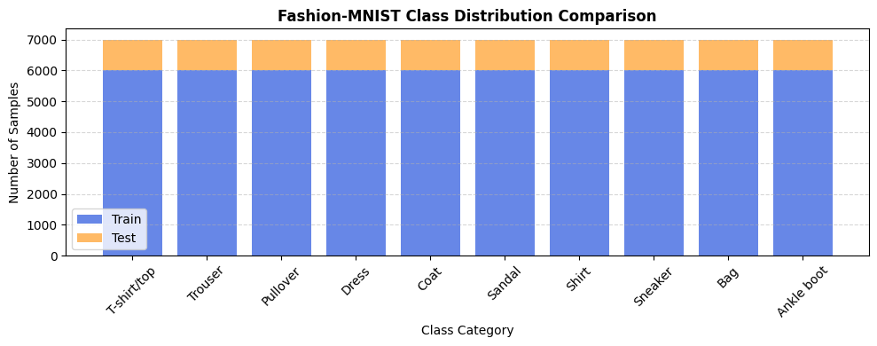
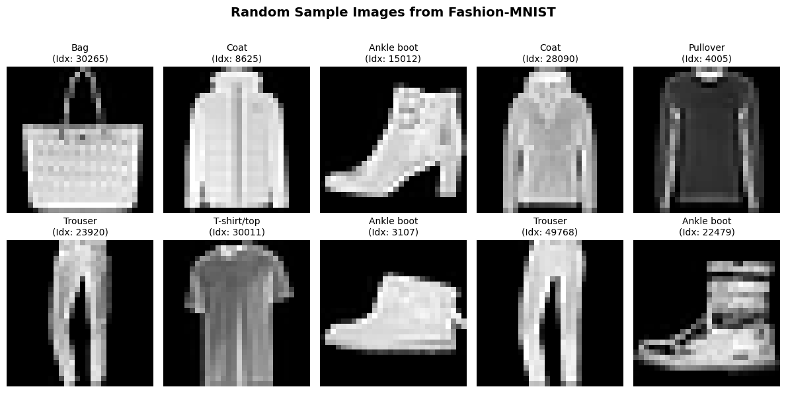
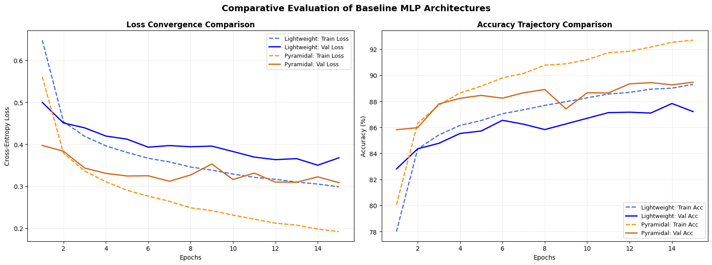
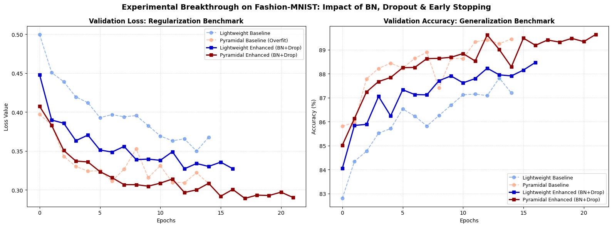
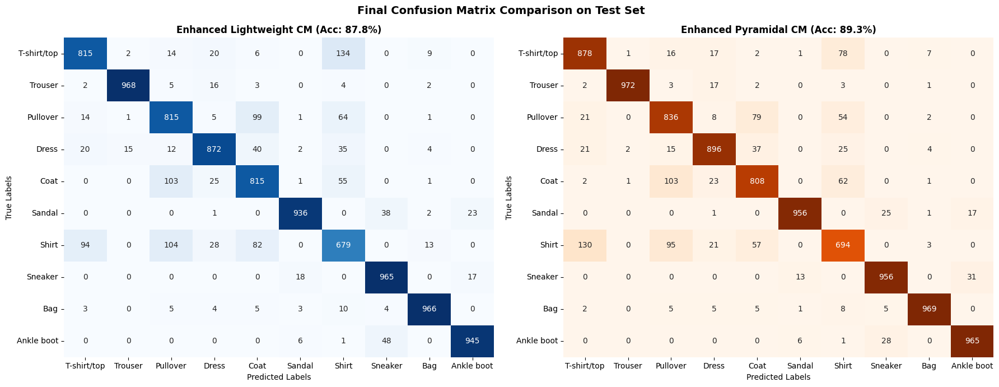
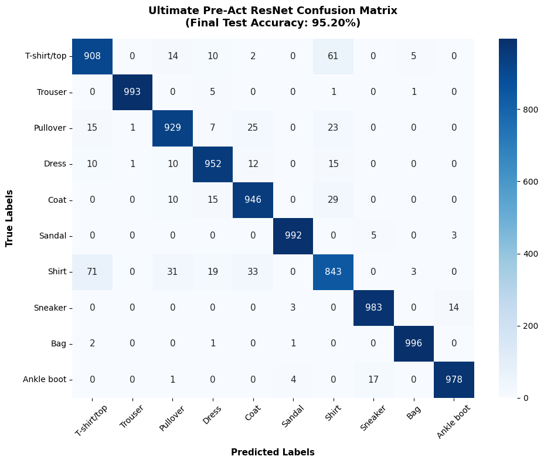
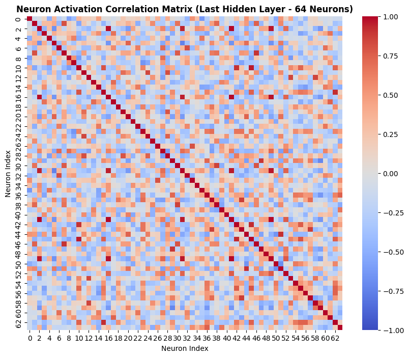
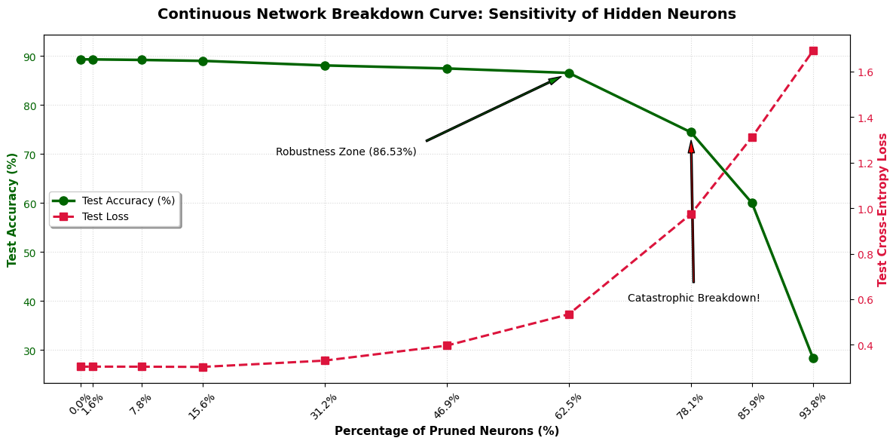
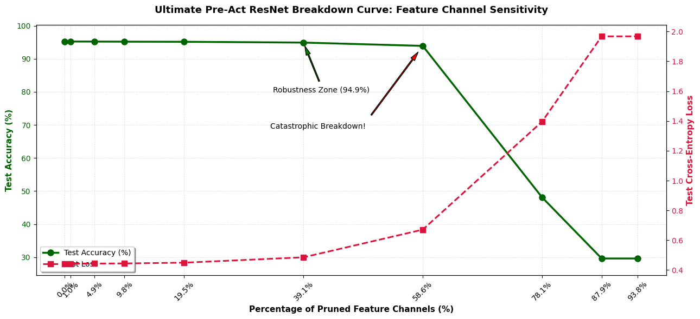

# 👕 Fashion-MNIST Evolution: From Deep MLPs to Ultimate Pre-Act ResNet + SE

  <a href="#english-version">🌐 English Version</a> •
  <a href="#فارسی">🌍 نسخه فارسی</a>

---

## 🇬🇧 English Version

This repository showcases an architectural evolution on the **Fashion-MNIST** dataset. It documents the journey from optimizing traditional multi-layer perceptrons (MLPs) to engineering an elite, highly robust **Pre-Activation ResNet** combined with **Squeeze-and-Excitation (SE)** attention mechanisms, pushing the accuracy boundaries up to **95.20%**.

### 🚀 CRITICAL RUNTIME CONFIGURATION (READ BEFORE RUNNING)

> ⚠️ **IMPORTANT NOTE FOR EXECUTION**
> Inside the very first code block, there is a global control variable named `train`. 
>
> * **If `train = True`:** The entire training pipeline executes, generating loss/accuracy curves, and optimizing weights from scratch.
> * **If `train = False`:** The system **skips all training and validation learning blocks**, bypasses epoch visualizations, and directly deploys the evaluation engine. It will automatically load the pre-trained champion weights (`ultimate_fashion_mnist_checkpoint.pt`) from the root folder to run immediate test benchmarks, confusion matrices, and dynamic pruning stress tests.

### 📊 Dataset Insights
Before modeling, a strict exploratory data analysis was conducted to ensure class balance and structural clarity across the train/test splits.

  

#### Random Data Visualization
| Random Sample Images from Fashion-MNIST |
| :---: |
|  |

### 📊 Architectural & Performance Benchmark
Below is the definitive experimental benchmark comparing both generations of neural architectures evaluated on 10,000 unseen test images:

| Architecture Generation | Model Name | Test Accuracy | Test Loss | Macro F1-Score | Training Dynamics |
| :--- | :--- | :---: | :---: | :---: | :--- |
| **Gen 1: Baseline MLP** | Enhanced Lightweight MLP | `87.76%` | `0.3397` | `0.8779` | Early Stopped at Epoch 17 |
| **Gen 1: Baseline MLP** | Enhanced Pyramidal MLP | `89.30%` | `0.3037` | `0.8929` | Early Stopped at Epoch 22 |
| **Gen 2: Deep CNN (Ours)** | **Ultimate Pre-Act ResNet + SE** | **`95.20%`** | `0.4428` | **`0.9519`** | Fully Optimized (100 Epochs) |

### 📈 Training Dynamics & Optimization Trajectory
The charts below show the progressive learning behaviors, highlighting how Batch Normalization, Dropout, and Early Stopping rescued the Pyramidal and Lightweight MLPs from severe overfitting:

| Loss Convergence Comparison | Validation Generalization Benchmark |
| :---: | :---: |
|  |  |

### 🛠️ Key Architectural Pillars of the Ultimate Model
1. **Pre-Activation Topology:** Shifts BatchNorm and ReLU prior to convolution layers, ensuring an unobstructed gradient highway across extreme depths.
2. **Squeeze-and-Excitation (SE) Attention:** Introduces channel-wise cross-examination, allowing the network to dynamically scale features based on critical item details.
3. **Stochastic Depth (DropPath):** Randomly deactivates residual blocks during training to enforce fierce regularization.
4. **Elite Optimization Regime:** Fueled by `AdamW`, scheduled via a smooth `Cosine Annealing LR`, and supervised using `Label Smoothing (0.05)`.

### 📋 Confusion Matrix & Error Analysis
The Ultimate ResNet heavily mitigates the historic *Shirt vs. T-shirt* confusion while locking absolute predictions on high-contrast structures:

| Baseline Generation Error Profiles (MLPs) | Champion Generation Elite Profile (Ultimate ResNet) |
| :---: | :---: |
|  |  |

### 🧠 Stress-Testing & Network Pruning Robustness
We subjected the networks to a dynamic pruning stress test by computing the Pearson Correlation Matrix across the final hidden representations and zeroing out the weights of highly redundant channels/neurons.

#### 1. Feature Representation Alignment (Correlation Matrices)
| MLP Hidden Layer Correlation (64 Neurons) | Ultimate ResNet Feature Correlation (512 Channels) |
| :---: | :---: |
|  |  |

#### 2. Network Breakdown Curves (Pruning Sensitivity)
* **Pyramidal MLP (64 Neurons):** Extremely fragile. Pruning 31.2% of its capacity led to severe decay, and hitting 78.1% caused a **Catastrophic Breakdown** (`images/image7.png`).
* **Ultimate ResNet (512 Channels):** Demonstrates flawless decentralized intelligence. Removing up to **100 feature channels (19.5% of the entire layer) resulted in 0.00% accuracy drops**, holding firmly at 95.14% (`images/image10.png`).

| MLP Breakdown Curve | Ultimate ResNet Breakdown Curve |
| :---: | :---: |
|  |  |

---

## 🌍 نسخه فارسی

این مخزن یک تحول معماری را بر روی مجموعه داده **Fashion-MNIST** به نمایش می‌گذارد. فرآیند توسعه از بهینه‌سازی شبکه‌های پرسپترون چندلایه سنتی
